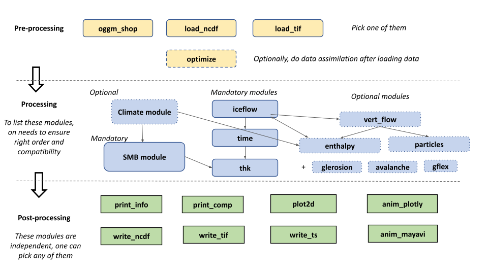

Assuming you have [installed](https://github.com/jouvetg/igm/wiki/1.-Installation) the right igm environment, the glacier evolution model IGM can be run via the command `igm_run`:
define
	igm_run --RGI-ID RGI60-11.01450 --time_start 2023 --time_end 2100

where parameters are given in command line as above or in a file params.json (recommended) like 

```json
{
  "modules_preproc": ["oggm_shop"],
  "modules_process": ["smb_simple","iceflow","time","thk"],
  "modules_postproc": ["write_ncdf","plot2d","print_info","print_comp"],
  "oggm_RGI_ID": "RGI60-11.01238",
  "time_start": 2023.0,
  "time_end": 2100.0
}
```

and [igm_run.py](https://github.com/jouvetg/igm/blob/main/igm_run.py) is a short python script located in the root directory that perform the following steps (check the [code](https://github.com/jouvetg/igm/blob/main/igm_run.py) for more details):
 
- collect parameters into `params` object, including the ordered list of modules `modules`,
- define a `state` object that contains all the data (e.g. ice thickness),
- initialize all model components in turn,
- update all model components in turn within a time loop from start to end times,
- finalize all model components in turn.

Therefore running IGM requires to define parameters `params`, which includes **first-of-all** the list of wished IGM modules.

IGM can also take the parameter file as input as follows: `igm_run --param_file params1.json`

# Parameters (`params`, [full list](https://github.com/jouvetg/igm/blob/main/doc/all.md))

IGM has a few core parameters:

|short|long|default|help|
| :--- | :--- | :--- | :--- |
||`--param_file`|`params.json`| Parameter file|
||`--modules_preproc`|`["prepare_data"]`|List of pre-processing modules|
||`--modules_process`|`["iceflow","time","thk"]`|List of processing modules|
||`--modules_postproc`|`["write_ncdf","print_info"]`|List of post-processing modules|
||`--logging`|`False`|Activate the logging|

and many other module-specific parameters, see the [full list of parameters](https://github.com/jouvetg/igm/blob/main/doc/all.md) or the  [module documentation](https://github.com/jouvetg/igm/wiki/3.-Modules) for the meaning and default values of the parameters of each module. Parameters passed in command line override those passed in the jon parameter file, which override the default IGM parameters.

# Modules (_modules_)



**IGM is organized module-wise.** Each user must pick a sequence of existing **pre-processing**, **processing**, **post-processing** and/or **user-made** modules she/he wishes to have for her/his application (check at the [module documentation](https://github.com/jouvetg/igm/wiki/3.-Modules). Each module implements all least 4 functions for module-specific parameter definition, initialization, update and finalization, which are called by `igm_run`. This section helps to chose the appropriate module. First one needs **pre-processing modules**:

  - For modelling individual present-day glacier, the best is to use the OGGM-based `prepare_data` module, which take care of downloading all the gridded data appropriatly. In that case, the `modules_preproc` in the json parameter file look like: 
```json 
   "modules_preproc": ["oggm_shop"], 
```
  - Alternatively to module `oggm_shop`, one may load the data directly NetCDF file (with module `load_ncdf`), tif file (with module `load_tif`) or from analytical formula for synthetic glacier tests (`synthetic`).

  - Optionally the additional module `optimize` permits to do data assimilation seeking for ice thickness distribution, ice flow parameters that yield the best fit with data (e.g. surface ice speeds). In that case, the `modules_preproc in the json parameter file look like: 
```json 
"modules_preproc": ["prepare_data","optimize"],
```
Second one needs to define **processing** modules:

  - The minimum to have as processing is the combination of ice flow (module `iceflow`), ice thickness (module `thk`), and time step (module `time`):

```json
  "modules_process": ["iceflow"","time","thk"],
```

  - However, it sounds reasonable to add at least a surface mass balance module (e.g. `smb_simple`), and other components we like to have (e.g. computation of vertical velocity, particle trajectory, climate, enthalpy, ...) making sure to respect a logical order, i.e., 

```json
  "modules_process": ["smb_simple","iceflow","time","thk","vert_flow","particles"],
```

Then, one needs **post-processing** modules to output the results of the model, e.g. this line will permit to write model output in NetCDF files, make 2D plots, print basic informatinN (e.g. ice volume), and produce a nice 3D animation of the run at the end:

```json
  "modules_postproc": [ "write_ncdf", "plot2d", "print_info",  "anim_mayavi" ]
```

Lastly, one often needs to customize the code for specific applications. This is easy to do so with IGM, e.g. for imposing own climate forcing, defining own surface mass balance, ... For that purpose, implement your module in a separate file my_mod.py, and add it to the workflow

```json
  "modules_process": ["smb_simple","iceflow","time","thk","my_mod"],
```
then, the module will be automatically loaded by `igm_run` when being executed.

  
