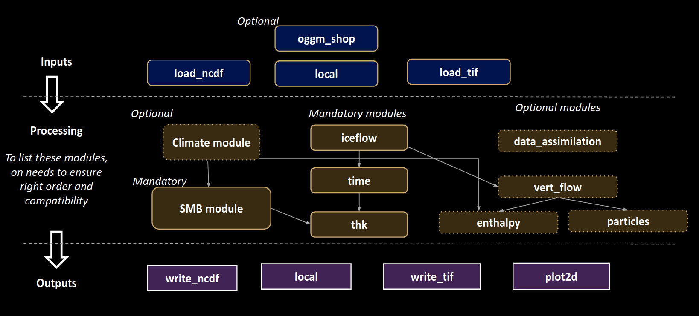

# Introduction

IGM is organized in a modular fashion, reflecting the similarity in tasks such as loading data, initializing fields, updating these fields within a time loop, and outputting results at regular intervals. Each module is designed to handle a specific aspect of the glacier evolution process, ensuring a clear and modular structure:

- The `inputs` modules are responsible for loading data, such as glacier bedrock and ice surface velocities.

- The `processes` modules implement physical mechanisms in a modular way, such as ice flow and mass conservation.

- The `outputs` modules handle writing or visualizing model results.

The main Python script `igm_run` is responsible for orchestrating the entire simulation process. It loads all `inputs`, `processes`, and `outputs` modules along with their parameters, initializes them, updates them within a time loop, and finalizes them. The majority of the IGM code resides within these modules, while the core structure remains minimal and lightweight. Each module includes:

- a name that is used to identify it (e.g., `greatmodule`).

- a source code located in `XXX/greatmodule/greatmodule.py`, where `XXX` is the folder `inputs`, `processes`, or `outputs` depending on the module's purpose.

- a parameter file located in `conf/XXX/greatmodule.yaml` containing default parameters.

- a help file located in `conf_help/XXX/greatmodule.yaml` that defines each parameter, including its type and unit.

- a documentation page in the `igm-doc` GitHub repository, which is used in the documentation.

For convenience, users can create their own module-parameter pairs in a dedicated `user` folder. These user-defined modules can be referenced directly from the parameter file, enabling customization and flexibility to extend the simulation's functionality. This approach allows users to tailor the simulation to their specific needs without altering the core modules. Check section on [user modules](https://jouvetg.github.io/igm-doc/latest/modules/user_modules/) for more information.

### Modular Structure of IGM

