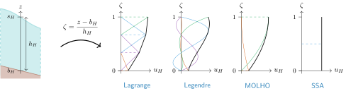
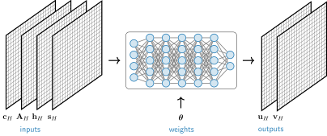

# Module `iceflow`

!!! info "Brief summary"

    The `iceflow` module allows to determine the horizontal **velocities** $(u,v)$ of the ice. To do so, it solves **higher-order** ice-flow equations by **minimizing** an associated energy. This can be done in a **traditional** way, by computing the velocities each the time the glacier configuration changes, or, instead, by training a **neural network** that maps that configuration to the velocities. The **parameters** of the module are described [here](#parameters).

!!! warning "Transition to unified mode"

    The unified framework (`method=unified`) is the recommended approach going forward. It consolidates the legacy solver (`method=solved`) and emulator (`method=emulated`) into a single architecture where the computational strategy is selected via the `mapping` parameter. Legacy modes are still supported for backward compatibility, but new projects should use the unified mode; it offers new features (e.g., additional optimizers and stopping criteria) and greater flexibility (e.g., support for custom mappings).

The `iceflow` module is described in further detail in [@IGM].

{{ render_module_io("iceflow") }}

## Quick start-up guide

The `iceflow` module can be configured in different ways. All modes solve the same physical problem; the difference is *how* the solution is computed.

### Legacy modes

**Solved mode**

Classical solve for the velocity field.  Example configuration file:

```yaml
iceflow:
  physics:
    init_slidingco: 0.0464      # Basal friction coefficient (MPa y^{1/3} m^{-1/3})
    init_arrhenius: 78.0        # Flow law coefficient (MPa^{-3} y^{-1})
  method: solved                # Classical solve
  solver:
    optimizer: adam             # Optimization algorithm
    step_size: 1.0              # Step size for optimizer
    nbitmax: 100                # Maximum number of iterations
```

**Emulated mode**

Training of a neural network that emulates the velocity field. Example configuration file:

```yaml
iceflow:
  physics:
    init_slidingco: 0.0464      # Basal friction coefficient (MPa y^{1/3} m^{-1/3})
    init_arrhenius: 78.0        # Flow law coefficient (MPa^{-3} y^{-1})
  method: emulated              # Neural-network emulation
  emulator:
    pretrained: true            # Use pre-trained network
    lr: 2.0e-05                 # Learning rate
    retrain_freq: 10            # Retrain frequency (every 10 time steps)
    nbit: 1                     # Number of training iterations per time step
```

### Unified mode

In the unified framework, the computational strategy is selected via the `mapping` parameter. 

**Identity mapping**

Classical solve for the velocity field. Example configuration file:

```yaml
iceflow:
  physics:
    init_slidingco: 0.0464      # Basal friction coefficient (MPa y^{1/3} m^{-1/3})
    init_arrhenius: 78.0        # Flow law coefficient (MPa^{-3} y^{-1})
  method: unified               # Unified framework
  unified:
    mapping: identity           # Classical solve
    optimizer: lbfgs            # L-BFGS optimizer
    nbit: 100                   # Number of optimization iterations
    retrain_freq: 1             # Retrain frequency (solve at every iteration)
```

**Network mapping**

Training of a neural network that emulates the velocity field. Example configuration file:

```yaml
iceflow:
  physics:
    init_slidingco: 0.0464      # Basal friction coefficient (MPa y^{1/3} m^{-1/3})
    init_arrhenius: 78.0        # Flow law coefficient (MPa^{-3} y^{-1})
  method: unified               # Unified framework
  unified:
    mapping: network            # Neural-network emulation
    optimizer: adam             # Adam optimizer
    retrain_freq: 10            # Retrain frequency (every 10 time steps)
    nbit: 1                     # Number of training iterations per time step
    adam:
      lr: 2.0e-05               # Learning rate
    network:
      pretrained: true          # Use pre-trained network
```

**Additional options**

The unified framework allows additional options, for instance boundary conditions and multi-stage optimization:

```yaml
iceflow:
  physics:
    init_slidingco: 0.0464      # Basal friction coefficient (MPa y^{1/3} m^{-1/3})
    init_arrhenius: 78.0        # Flow law coefficient (MPa^{-3} y^{-1})
  method: unified               # Unified framework
  unified:
    mapping: network            # Neural-network emulation
    bcs: [frozen_bed]           # Boundary conditions
    optimizer: sequential       # Multi-stage optimization
    sequential:
      stages:
        - optimizer: adam       # Stage 1: Adam optimizer
          nbit: 10000           # 10000 iterations
        - optimizer: lbfgs      # Stage 2: L-BFGS optimizer
          nbit: 1000            # 1000 iterations
```

## Physical model

Ice flow is governed by momentum balance and mass conservation. For glaciers and ice sheets with shallow geometry (horizontal extent ≫ thickness) and cryostatic vertical stresses, the three-dimensional Stokes equations reduce to the **Blatter-Pattyn higher-order model** [@Herterich1987; @Blatter1995; @Pattyn2003], a system of coupled, nonlinear, elliptic PDEs for the horizontal velocity field $\mathbf{u}=(u,v)$.

### Minimization formulation

Rather than solving these PDEs directly, IGM adopts an **energy minimization approach** [@Jouvet2011; @Jouvet2016]. The main advantage is that various optimizers can be applied to minimize this energy; in particular, both classical and neural-network approaches [@Jouvet2023b].

The velocity field $\mathbf{u}$ that satisfies the momentum balance is the one that minimizes the mechanical energy functional:

$$
\mathcal{J}(\mathbf{u}) = {\int_{\Omega} \frac{2\,A^{-1/n}}{1+1/n} \vert \mathbf{D}(\mathbf{u}) \vert^{1+1/n}\,\mathrm{d}\Omega} + {\int_{\Gamma_\mathrm{b}} \frac{c \vert\mathbf{u}_\mathrm{b}\vert^{1+1/m}}{1+1/m}\,\mathrm{d}\Gamma} - {\int_{\Omega} \rho_\mathrm{i} g \,\nabla s \cdot \mathbf{u}\,\mathrm{d}\Omega} - {\int_{\Gamma_\mathrm{cf}} \left[\rho_\mathrm{i} g (s-z) - p_\mathrm{w}\right] \mathbf{u}\cdot\mathbf{n}\,\mathrm{d}\Gamma},
$$

where $\Omega$ is the three-dimensional ice domain, $\Gamma_\mathrm{b}$ is the basal boundary, $\Gamma_\mathrm{cf}$ is the calving front (absent for land-terminating glaciers), and $s$ is the upper surface elevation. The four terms correspond to different physical processes:

- The first term represents viscous dissipation. Here, $\mathbf{D}(\mathbf{u}) = (\nabla \mathbf{u} + \nabla \mathbf{u}^\top)/2$ is the strain-rate tensor, $A$ is the Arrhenius factor, and $n$ is the flow law exponent.
- The second term represents basal friction dissipation, here parametrized with a Weertman law. Here, $c$ is the friction coefficient, $\mathbf{u}_\mathrm{b}$ is the basal velocity, and $m$ is the power-law exponent.
- The third term represents gravitational power, which is the driving force. Here, $\rho_\mathrm{i}$ is ice density and $g$ is gravitational acceleration.
- The fourth term accounts for the calving-front energy in marine-terminating glaciers, where $p_\mathrm{w}$ is the hydrostatic water pressure and $\mathbf{n}$ is the outward horizontal unit normal to $\Gamma_\mathrm{cf}$.

The ice velocity is found by minimizing this functional:

$$
\mathbf{u} = \arg\min_{\mathbf{{v}}} \mathcal{J}(\mathbf{v}; c, A, h, s),
$$

where the functional depends on the evolving glacier state through the following variables:

- basal friction coefficient $c$;
- Arrhenius factor $A$; 
- ice thickness $h$;
- surface elevation $s$.

## Numerical set-up

To make the continuous energy minimization problem computationally tractable, we discretize the velocity field on a structured grid. This discretization transforms the infinite-dimensional optimization problem into a finite-dimensional one where the unknowns are velocity degrees of freedom, typically velocity values at discrete spatial locations.

### Horizontal discretization

The horizontal domain is discretized on a **uniform rectangular grid** of size $N_x \times N_y$ with constant cell spacing $H =\Delta x = \Delta y$. Discrete variables such as friction coefficient $c_H$, flow law coefficient $A_H$, ice thickness $h_H$, and surface elevation $s_H$ are defined at grid cell corners. We use subscript $H$ to denote these discrete quantities defined on the horizontal grid. These discrete fields are represented as 2D tensors: $\mathbf{c}_H, \mathbf{A}_H, \mathbf{h}_H, \mathbf{s}_H \in \mathbb{R}^{N_y \times N_x}$. At a grid point $(x_i, y_j)$, the discrete values are denoted:

$$
(\mathbf{c}_H)_{j,i} = c(x_i, y_j), \quad  (\mathbf{A}_H)_{j,i} = A(x_i, y_j), \quad (\mathbf{h}_H)_{j,i} = h(x_i, y_j), \quad (\mathbf{s}_H)_{j,i} = s(x_i, y_j).
$$

On this regular grid, the approximation space consists of piecewise linear functions (equivalently, P1 finite elements or linear shape functions). Spatial derivatives in the horizontal direction are approximated by finite differences on a staggered grid, which is equivalent to the gradient of piecewise linear interpolants. This structured discretization enables efficient GPU-accelerated computation and natural representation of fields as 2D/3D arrays.

### Vertical discretization

In general, the vertical structure of ice flow might be complex, with velocity varying from zero at the bed to maximum at the surface, and with strong gradients near the base where sliding occurs. To capture this, we use a **terrain-following coordinate**:

$$
\zeta = \frac{z - b_H}{h_H} \in [0,1],
$$

where $z$ is the physical elevation. This mapping ensures $\zeta=0$ at the bed and $\zeta=1$ at the surface, regardless of ice thickness or bed topography.

The velocity field is then represented as a Galerkin expansion onto vertical basis functions: at each horizontal grid point $(x_i, y_j)$, we write

$$
u(x_i,y_j,z) = \sum_{k=1}^{N_z} (\mathbf{u}_H)_{k,j,i} \, \phi_k(\zeta(z)), \quad v(x_i,y_j,z) = \sum_{k=1}^{N_z} (\mathbf{v}_H)_{k,j,i} \, \phi_k(\zeta(z)),
$$

in which $N_z$ is the number of vertical degrees-of-freedom per column, $\{\phi_k(\zeta)\}_{k=1}^{N_z}$ are the vertical basis functions and $(\mathbf{u}_H)_{k,j,i}$ denotes the $(k,j,i)$-th component of the degrees-of-freedom tensor $\mathbf{u}_H$, and similarly for $\mathbf{v}_H$. These last tensors,

$$
\mathbf{u}_H, \mathbf{v}_H \in \mathbb{R}^{N_z \times N_y \times N_x}
$$

are the fundamental unknowns to be determined by the optimization procedure, as described in the next section.

#### Vertical basis functions

Four basis types are available via `numerics.basis_vertical`:

| Basis | $N_z$ | Description |
|-------|-------|-------------|
| `ssa` | $1$ | Shallow-shelf profile (depth-averaged velocity) |
| `molho` | $2$ | Shallow-ice profile [@DiasdosSantos2022] |
| `lagrange` | $\geq 1$ | Lagrange shape functions |
| `legendre` | $\geq 1$ | Legendre polynomials |

<div class="full-width-figure" markdown="1">
  
  <p style="text-align: center; font-style: italic; margin-top: 0.5rem;">Vertical discretization schematic. The terrain-following coordinate ζ = (z − b<sub>H</sub>)/h<sub>H</sub> maps the ice column to [0,1]. Four vertical basis types are shown: Lagrange (piecewise polynomial interpolation), Legendre (polynomial expansion), MOLHO (Shallow Ice profile), and SSA (Shallow Shelf profile, depth-averaged).</p>
</div>

## Optimization set-up

With the velocity field discretized as DOF tensors $(\mathbf{u}_H, \mathbf{v}_H)$, the continuous energy minimization problem becomes a finite-dimensional optimization:

$$
\mathbf{u}_H^*, \mathbf{v}_H^* = \arg\min_{\mathbf{u}_H, \mathbf{v}_H} \mathcal{J}\left(\mathbf{u}_H, \mathbf{v}_H; \mathbf{c}_H, \mathbf{A}_H, \mathbf{h}_H, \mathbf{s}_H\right).
$$

IGM supports two main computational strategies for solving this optimization problem, both minimizing the same physical energy functional $\mathcal{J}$ but differing in *what* is optimized:

1. **Direct velocity optimization** (traditional solver): Optimize velocity degrees-of-freedom $(\mathbf{u}_H, \mathbf{v}_H)$ directly.

2. **Neural network emulation** (neural-network emulator): Optimize network weights that map the inputs $\left(\mathbf{c}_H, \mathbf{A}_H, \mathbf{h}_H, \mathbf{s}_H\right)$ to the velocity degrees-of-freedom $(\mathbf{u}_H, \mathbf{v}_H)$.

The unified framework generalizes both strategies by introducing an abstract parameter vector $\boldsymbol{\theta}$ and a mapping function $\mathcal{M}$ that relates potential parameters to velocities:

$$
\boldsymbol{\theta}^* = \arg\min_{\boldsymbol{\theta}} \mathcal{J}\left(\mathcal{M}(\boldsymbol{\theta}); \mathbf{c}_H, \mathbf{A}_H, \mathbf{h}_H, \mathbf{s}_H\right), \quad (\mathbf{u}_H, \mathbf{v}_H) = \mathcal{M}(\boldsymbol{\theta}).
$$


### Mappings

#### Identity mapping: `unified.mapping: identity`

$$
  \mathcal{M} = \mathcal{I} \quad \Rightarrow \quad  (\mathbf{u}_H, \mathbf{v}_H) = \boldsymbol{\theta}
$$

The parameters $\boldsymbol{\theta}$ are the velocity degress-of-freedom themselves; the mapping is simply the identity mapping $\mathcal{I}$. At each time step, the energy functional $\mathcal{J}$ is minimized by optimizing $(\mathbf{u}_H, \mathbf{v}_H)$ directly given the current glacier state $(\mathbf{c}_H, \mathbf{A}_H, \mathbf{h}_H, \mathbf{s}_H)$. This is the traditional solver approach.

#### Network mapping: `unified.mapping: network`

$$
  \mathcal{M} = \mathcal{N} \quad \Rightarrow \quad   (\mathbf{u}_H, \mathbf{v}_H) = \mathcal{N}(\boldsymbol{\theta})
$$

The parameters $\boldsymbol{\theta}$ are the weights of a neural network $\mathcal{N}$ that maps glacier state $(\mathbf{c}_H, \mathbf{A}_H, \mathbf{h}_H, \mathbf{s}_H)$ to velocity degrees-of-freedom. Typically, the network can be a convolutional neural network [@LeCun2015]. Pretrained network can be chosen by specifying `unified.network.pretrained: true`.

<div class="mapping-figure" markdown="1">
  
  <p style="text-align: center; font-style: italic; margin-top: 0.5rem;">Network mapping architecture. The neural network parameterized by weights θ maps the glacier state (inputs: c<sub>H</sub>, A<sub>H</sub>, h<sub>H</sub>, s<sub>H</sub>) to velocity degrees of freedom (outputs: u<sub>H</sub>, v<sub>H</sub>).</p>
</div>

### Optimization algorithms

All optimizers operate on the abstract parameter $\boldsymbol{\theta}$ via an iterative scheme:

$$
\boldsymbol{\theta}^{(k+1)} = \boldsymbol{\theta}^{(k)} + \alpha^{(k)} \, \mathbf{d}^{(k)},
$$

where $\mathbf{d}^{(k)}$ is the search direction and $\alpha^{(k)}$ is the step size. Typically, $\mathbf{d}^{(k)}$ is computed based on the gradient $\nabla_{\boldsymbol{\theta}} \mathcal{J}(\boldsymbol{\theta}^{(k)})$, which is computed automatically using TensorFlow's automatic differentiation.

Available optimizers:

| Optimizer | Description | Reference |
|-----------|-------------|-----------|
| `adam` | Adaptive Moment Estimation: maintains running averages of gradient (first moment) and gradient magnitude (second moment) | [@Kingma2015] |
| `lbfgs` | Limited-memory BFGS: quasi-Newton method approximating the inverse Hessian using gradient history | [@Nocedal2006] |
| `soap` | SOAP (Shampoo with Adam): second-order optimizer combining Shampoo-style preconditioned updates with Adam's moment estimation; effective for physics-informed neural network training | [@Vyas2024] |
| `sequential` | Multi-stage optimization allowing different optimizers and iteration counts in successive phases (see the [quick start-up guide](#unified-mode)) | - |

### Convergence criteria

Optimization terminates when a success or failure criterion is met. Multiple criteria can be specified. Example configuration file:

```yaml
unified:
  halt:
    success:
      - criterion: rel_tol
        metric: grad_u_norm
        tol: 1.0e-6
        ord: l2
    failure:
      - criterion: nan
      - criterion: inf
```

**Success criteria**: `halt.success`

| Criterion | Description |
|-----------|-------------|
| `rel_tol` | Relative change in metric below tolerance |
| `abs_tol` | Absolute metric value below tolerance |
| `patience` | No improvement for specified iterations |

**Failure criteria**: `halt.failure`

| Criterion | Description |
|-----------|-------------|
| `nan` | NaN values detected |
| `inf` | Inf values detected |

**Metrics**: `metric`

| Metric | Description |
|--------|-------------|
| `cost` | Energy functional value |
| `grad_u_norm` | Velocity gradient norm |
| `grad_theta_norm` | Parameter gradient norm |
| `u` | Velocity degrees-of-freedom |
| `theta` | Optimization parameters |

### Boundary conditions

Boundary conditions are configured via `unified.bcs`:

| Condition | Equation |
|-----------|----------|
| `frozen_bed` | $\mathbf{u}\vert_{z=b} = \mathbf{0}$ |
| `periodic_ns` | $\mathbf{u}\vert_{y=L_y} = \mathbf{u}\vert_{y=0}$ |
| `periodic_we` |$\mathbf{u}\vert_{x=L_x} = \mathbf{u}\vert_{x=0}$ |

## Practical guidance

### Choosing a mapping

Use **`identity`** for verification purposes — small domains and short simulations where you want to check that the solver is behaving correctly. Use **`network`** for production runs: it is faster and scales better to larger domains and longer projections.

!!! warning "Learning rates differ significantly between mappings"
    Always set **both** `lr` and `lr_init` explicitly — relying on defaults when switching mappings is a common source of problems.

    - `mapping: identity` — use `lr` / `lr_init` ≈ **0.9**
    - `mapping: network` — use `lr` / `lr_init` in the range **1e-5 – 1e-3**

    A learning rate that is too high can cause numerical instabilities or a fully diverging run. If you observe velocities blowing up or NaN values in the output, reducing the learning rate is the first thing to try.

### Validating `nbit`

`nbit` controls how many optimisation iterations are used per iceflow solve. Increasing it improves accuracy at the cost of compute time. A practical check: double `nbit` and verify that the resulting velocities change by less than ~5%.

To monitor convergence, watch the iceflow cost function value printed during the run — it should decrease and plateau. If it keeps oscillating or fails to decrease, try:

- Increasing `nbit`.
- Reducing the learning rate (`lr` / `lr_init`).
- Running a short test with `mapping: identity` for comparison (remember to adjust `lr` / `lr_init` to ~0.9 for that case).

### Checkerboard artefacts

When using the direct solver (`mapping: identity`), the default single-point cell-centred horizontal quadrature can admit **checkerboard zero-energy modes** — spurious oscillations in the velocity field where neighbouring cells move in opposite directions without contributing to the energy.

If you observe a checkerboard pattern in the velocity output, switch to a higher-order horizontal integration scheme via `numerics.basis_horizontal`:

| Value | Scheme | Cost |
|---|---|---|
| `central` | Single cell-centred evaluation point (default) | Lowest, but susceptible to checkerboard modes |
| `q1` | 2×2 Gaussian quadrature on bilinear (Q1) elements | Eliminates checkerboard modes |
| `p1` | P1 triangulation (each cell split into two triangles) | Eliminates checkerboard modes |
| `mac` | Marker-and-cell staggered-grid scheme | Eliminates checkerboard modes |

Example configuration:

```yaml
processes:
  iceflow:
    method: unified
    unified:
      mapping: identity
      numerics:
        basis_horizontal: q1   # or p1
```

!!! note
    This issue is specific to the direct solver (`mapping: identity`). The neural-network emulator (`mapping: network`) is not affected because the network weights parameterize the velocity field globally, which inherently suppresses such spurious modes.

### Choosing a vertical basis

Start with **MOLHO** (`basis_vertical: molho`, `Nz: 2`) — it captures the essential shear-sliding partition at low computational cost and is the recommended choice for most applications.

Switch to **Lagrange** with `Nz` between 4 and 10 only when a more detailed vertical velocity profile is needed (e.g. studies of englacial flow or vertical strain).

### Common issues

**Ice accumulating at domain borders**

If ice builds up artificially along the edge of the domain, set `exclude_borders_from_iceflow: True`:

```yaml
processes:
  iceflow:
    exclude_borders_from_iceflow: True
```

This prevents the solver from computing velocities in cells that touch the domain boundary, which can otherwise cause spurious accumulation.

---

## Vertical velocity

The `iceflow` module can optionally compute the **3D vertical velocity** field $w$ (and its basal and surface projections $w_\mathrm{b}$, $w_\mathrm{s}$) immediately after the horizontal velocity update. This sub-computation is disabled by default and enabled via:

```yaml
iceflow:
  vertical_velocity:
    enabled: true   # default: false
    version: 2      # default: 2
    method: kinematic  # default: kinematic
```

When enabled, the following state variables are produced:

- `state.W` — 3D vertical velocity field (shape `Nz × Ny × Nx`)
- `state.wvelbase` — vertical velocity at the bed
- `state.wvelsurf` — vertical velocity at the surface

!!! note "Required for particles and enthalpy"
    Set `iceflow.vertical_velocity.enabled: true` when using 3D particle tracking (`particles.tracking.method: "3d"`) or the `enthalpy` module for physically accurate vertical advection.

### Physical principle

Both methods enforce the kinematic basal condition — that ice velocity is parallel to the bed:

$$
w_\mathrm{b} = u_\mathrm{b} \frac{\partial b}{\partial x} + v_\mathrm{b} \frac{\partial b}{\partial y}.
$$

They differ in how $w$ is extended through the column.

#### Kinematic method (`method: kinematic`)

The kinematic method requires that ice velocity be tangent to each terrain-following layer surface. At layer elevation $z_\zeta = b + \zeta H$:

$$
w = u \frac{\partial z_\zeta}{\partial x} + v \frac{\partial z_\zeta}{\partial y} - \nabla \cdot (\bar{\mathbf{u}}_\zeta \, z_\zeta),
$$

where $\bar{\mathbf{u}}_\zeta$ is the depth-averaged velocity from the bed up to that layer. This naturally accounts for terrain through the layer-slope terms.

#### Incompressibility method (`method: incompressibility`)

The incompressibility method integrates the divergence-free condition $\nabla \cdot \mathbf{u} = 0$ from the bed upward:

$$
w(\zeta) = w_\mathrm{b} - \int_0^\zeta \left(\frac{\partial u}{\partial x} + \frac{\partial v}{\partial y}\right) H\,\mathrm{d}\zeta'.
$$

Because $u$ and $v$ are discretized at constant $\zeta$ while the incompressibility condition requires horizontal derivatives at constant physical height $z$, the derivatives must be transformed via the chain rule:

$$
\left.\frac{\partial u}{\partial x}\right|_z = \left.\frac{\partial u}{\partial x}\right|_\zeta - \left[\frac{\partial b}{\partial x} + \zeta\frac{\partial H}{\partial x}\right] \frac{\partial u}{\partial z}.
$$

### Versions

| `version` | Kinematic | Incompressibility | Terrain correction | Implementation | Author |
|:---:|:---:|:---:|:---:|:---|:---|
| `1` | ✓ | ✓ | Kinematic only | Direct numerical derivatives | GJ |
| `2` | ✓ | ✓ | ✓ | Numerical integration with terrain chain rule | CMS |
| `3` | — | ✓ | ✓ | Matrix-based with precomputed operators | TG |

Versions 1 and 2 support `kinematic` and `incompressibility` when using the Lagrange vertical basis. For Legendre basis, both use a spectral incompressibility method. For MOLHO basis, both use a two-layer kinematic approach. Version 3 implements only the incompressibility method for all bases.

---

## Parameters

The complete default configuration file can be found here: [iceflow.yaml](https://github.com/instructed-glacier-model/igm/blob/main/igm/conf/processes/iceflow.yaml).










{{ render_contributors("iceflow") }}
