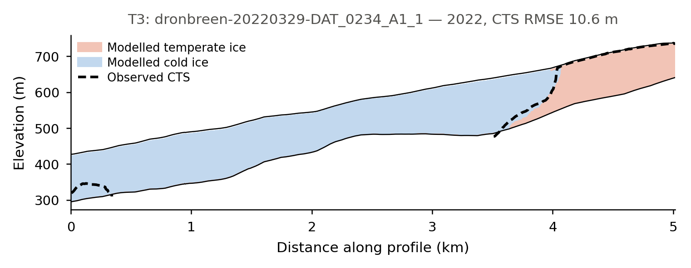

# Drønbreen: polythermal ice and the enthalpy module

Many glaciers outside the tropics are **polythermal**: part of the ice is *cold*, below its pressure-melting point and effectively free of liquid water, and part is *temperate*, at the melting point and carrying water between the grains. The two behave very differently — temperate ice is softer, deforms faster, and lets water reach the bed — so where the boundary between them sits shapes how the glacier flows.

This tutorial models that boundary — the **cold–temperate transition surface (CTS)** — on Drønbreen, a Scandinavian-type polythermal glacier in Nordenskiöld Land, Svalbard, and calibrates it against ten ground-penetrating radar (GPR) lines that mapped the real CTS in March 2022 [@Mannerfelt2025]. It is the reference example for IGM's [`enthalpy`](../modules/processes/enthalpy.md) module, and it also exercises [`subglacial_hydrology`](../modules/processes/subglacial_hydrology.md) in `till_storage` mode.

!!! info "Why an enthalpy formulation"
    Tracking temperature alone cannot describe temperate ice, whose temperature is pinned at the melting point however much heat is added — the extra energy goes into water content instead. Enthalpy carries both in one variable: the ice is temperate wherever `E >= E_pmp`, and the CTS is the level where the two meet. IGM follows the enthalpy formulation of [@Aschwanden2012].

---

## Setup

Clone the examples repository and move into the Drønbreen folder:

```bash
git clone https://github.com/instructed-glacier-model/igm-examples.git
cd igm-examples/enthalpy-dronbreen
```

All data ships with the repository — nothing is downloaded. The folder layout is:

```
enthalpy-dronbreen/
  data/                # input_dronbreen.nc + cts_gpr/ (the radar observations)
  experiment/          # one params_stepN_*.yaml per step (+ common/ fragment)
  optuna/              # sweeper configuration for Step 2
  tools/               # post-processing scripts, and the shared CTS diagnostic
  user/                # custom process modules
    code/processes/    # Python source files
    conf/processes/    # Hydra config stubs
```

Beyond IGM itself, the calibration and the plotting scripts need `optuna`, `pandas`, `scipy`, `netCDF4` and `xarray`.

!!! tip
    Prefix any command with `TF_CPP_MIN_LOG_LEVEL=3` to silence verbose TensorFlow logging. Results are written to a timestamped subfolder under `outputs/` (or to the directory passed via `hydra.run.dir=`).

---

## Step 1: Thermal spin-up on a fixed geometry

The first experiment runs Drønbreen from 1900 to 2022 under a constant climate derived from CARRA reanalysis, and lets the thermal state come into equilibrium with it.

### How it works

Four processes form a loop, and the order in the configuration is not arbitrary:

1. **`clim_carra_ela`** (custom) turns the two 2-D air-temperature fields in the input file into the monthly series the enthalpy surface boundary condition expects.
2. **`iceflow`** solves for the velocity field, which supplies the strain heating inside the ice and the frictional heating at the bed.
3. **`enthalpy`** advects and diffuses that heat, producing `E`, `E_pmp`, the temperature `T` and the water content `omega`.
4. **`arrhenius`** converts the new temperature into a flow-rate factor, which softens the ice and feeds back into the next ice-flow solve.

`subglacial_hydrology` closes the loop at the bed: in `till_storage` mode it evolves a till water layer fed by basal melt, and derives an effective pressure from it. That mode **requires `enthalpy` to have run before it**, since basal melt is an enthalpy output.

There is deliberately **no `thk` process**. The geometry is held fixed, so the ice surface never moves and only the thermal state evolves. That is the honest setup for the question being asked — the observations to be reproduced are a thermal structure, not a geometry — and it keeps the run cheap.

!!! tip "How long does a thermal spin-up need to be?"
    Long enough to forget its initial condition, and no longer. For this glacier the modelled CTS settles within about **70 years** of the start, so 1900–2022 is comfortable. Starting in 1600 instead costs four times the compute and moves the misfit by under 2%. It is worth measuring this for your own setup rather than assuming centuries are required: save at a short interval, plot a bulk diagnostic such as the mean temperate-layer thickness against time, and read off where it flattens.

!!! note "The two vertical grids are independent"
    `iceflow` uses `Nz: 2` because the MOLHO basis represents the vertical velocity profile analytically — two degrees of freedom per column are enough. `enthalpy` uses `Nz: 30`, packed towards the bed by `vert_spacing: 4.0`, because the CTS is a sharp feature sitting in the lower part of the column. Mixing the two up is the classic mistake here; the example keeps them explicitly separate, and the saved NetCDF gives the thermal fields their own vertical dimension.

### The refreezing proxy

On a Scandinavian-type polythermal glacier, most temperate ice does not form at the bed. It forms in the accumulation area, where summer meltwater percolates into the firn and refreezes, releasing latent heat that warms the ice to the melting point before it is buried and carried downglacier.

IGM does not model firn refreezing explicitly, so this example substitutes a deliberate proxy: **above the equilibrium line, the air temperature driving the surface boundary condition is replaced by a constant**.

```yaml
# experiment/params_step1_spinup.yaml (excerpt)
processes:
  clim_carra_ela:
    ela: 666.0         # m a.s.l.
    T_ela: 0.42        # °C imposed above the ELA -- the refreezing proxy
```

This is a parameterisation, not physics. `T_ela` should be read as "the surface forcing that reproduces the observed thermal structure", not as a measured temperature — which is precisely why Step 2 calibrates it rather than prescribing it, and why the value shipped above comes from that calibration.

### Configuration

```yaml
# experiment/params_step1_spinup.yaml (excerpt)
defaults:
  - common: iceflow_molho                                     # shared ice-flow setup
  - /user/conf/processes@processes.clim_carra_ela: clim_carra_ela
  - override /inputs:
    - local
  - override /processes:
    - clim_carra_ela          # surface air temperature -> enthalpy boundary condition
    - iceflow                 # velocities -> strain and friction heating
    - enthalpy                # the thermal state: E, E_pmp, T, omega
    - arrhenius               # temperature-dependent flow factor -> back into iceflow
    - subglacial_hydrology    # till water storage -> effective pressure
    - time
  - override /outputs:
    - local

processes:
  enthalpy:
    numerics:
      Nz: 30                        # fine thermal grid...
      vert_spacing: 4.0             # ...packed towards the bed, where the CTS sits
    thermal:
      basal_heat_flux_ref: 0.044    # W m^-2, calibrated in Step 2

  subglacial_hydrology:
    mode: till_storage              # Tulaczyk till hydrology

  time:
    start: 1900.0
    end:   2022.0
    save:  20.0
```

### Run

```bash
igm_run +experiment=params_step1_spinup
```

Roughly two minutes on a GPU. The reported ice volume stays constant throughout — the geometry is fixed, so that is the expected behaviour, not a sign that nothing is happening.

Then compare the modelled thermal structure with the radar:

```bash
python tools/plot_cts_sections.py --run outputs/<date>/<time>
python tools/plot_cts_sections.py --run outputs/<date>/<time> --all   # every radar line
```

Each figure is a vertical section along one GPR line, and carries only three things: modelled temperate ice in red, modelled cold ice in blue, and the radar-observed CTS laid over them as a dashed black line. The modelled CTS is not drawn separately — it *is* the boundary between the two fills. So the comparison is read directly off the figure: where the dashed line runs through blue, the model made too little temperate ice; where it runs through red, too much.

{ width="78%" }

This is the polythermal structure the example exists to reproduce: cold ice fills the deep central trough, where the ice is thick and the surface is low, while temperate ice occupies both flanks, where it is thinner and closer to the accumulation area. The radar sees the transition climbing the right-hand flank, and the model puts it in much the same place.

With no argument, the script picks the radar line that best displays a transition. Several of the ten cross almost entirely cold ice, or entirely temperate ice, and come out as one flat colour — informative about the glacier, but not about the CTS.

### The whole survey

One section shows the shape of the fit on one line. Run `--all` to get every transect, which is worth doing once:

```bash
python tools/plot_cts_sections.py --run outputs/<date>/<time> --all
```

Transects are labelled `T1`–`T10` in order of how much temperate ice the radar found, so `T1` is the most temperate line. The label comes from the observations alone, so it stays attached to the same radar line whatever the model does.

Across the ten of them the model reproduces about **89% of the observed temperate ice** in total, which sounds healthy — but that aggregate hides real differences. `T5` and `T7` come out essentially cold where the radar sees a clear temperate layer, while `T6` carries nearly twice the observed amount. Compensating errors of this kind are exactly what a single misfit number conceals, so it is worth looking line by line before trusting the headline score.

---

## Step 2: Calibrating the thermal forcing against the radar

Step 1 prescribes the two heat sources that set the thermal structure, and neither is well known: how much latent heat the accumulation area delivers from above (`T_ela`, applied above `ela`), and how much geothermal heat arrives from below (`basal_heat_flux_ref`). Step 2 lets the observations decide.

### How the misfit reaches Optuna

The custom `track_cts_err` process module loads the GPR profiles when the run starts and, in its `finalize` hook, extracts the modelled CTS at every radar point by interpolating `E - E_pmp` to its zero crossing. It writes the mean per-profile RMSE into `state.score`:

```python
state.score["cost_cts"] = cost
```

`igm_run` serialises `state.score` at the end of every run, and the IGM Optuna sweeper reads it back — so the objective name in the sweeper configuration must match the key:

```yaml
# optuna/optuna_cts.yaml (excerpt)
objectives:
  - name: cost_cts
    direction: minimize

n_trials: 40
n_jobs: 3                     # three concurrent runs saturate a single mid-range GPU
storage: sqlite:///optuna_cts.db
study_name: dronbreen_cts

sampler:
  method: TPESampler

parameters:
  - name: processes.clim_carra_ela.T_ela
    type: float
    low: -0.5
    high: 2.0
  - name: processes.clim_carra_ela.ela
    type: float
    low: 650.0
    high: 720.0
  - name: processes.enthalpy.thermal.basal_heat_flux_ref
    type: float
    low: 0.030        # W m^-2, brackets the Svalbard estimates
    high: 0.080
```

!!! note "Choosing what to calibrate"
    The length of the spin-up is deliberately *not* a search parameter. Since the thermal state equilibrates within ~70 years and every trial starts in 1900, the start date cannot affect the cost — searching over it would burn a third of the sweep on a dimension the data cannot constrain. Before adding a parameter, it is worth asking whether the observations can see it at all; `tools/plot_optuna.py` will show an uninformative parameter as a flat cloud of cost against its value.

Columns with no enthalpy sign change are not discarded but resolved: an entirely cold column has its CTS at the bed, an entirely temperate one at the surface. Dropping them instead would make the misfit blind in one direction — a model that froze the whole glacier solid would contribute no points and so incur no penalty.

### How to tell whether a misfit is any good

A misfit in metres means nothing on its own. Before trusting one, ask what a model that
knows nothing would score — and this objective deserves that scrutiny, because on 60% of
the radar points there is no temperate ice at all. There `temperate_elevation` equals the
bed elevation, so the "observation" is really *there is no CTS here* rather than a
measured surface. If those points dominated, a trivially cold glacier would score well
and the calibration would be measuring nothing.

Two null models answer it. Run the same diagnostic against a glacier forced entirely
cold (CTS pinned to the bed) and entirely temperate (CTS at the surface), and compare:

| | `cost_cts` |
|---|---|
| All cold — CTS pinned to the bed | 37.4 m |
| All temperate | 89.9 m |
| Calibrated model | ≈19 m |

The numbers above are for this setup; what matters is the *ratio*. Roughly halving the
error of the best null says the objective carries real information. Had the calibrated
run landed near 37 m, it would have been no better than assuming the glacier is frozen
throughout — the same number, but worthless.

It is worth going one step further and splitting the misfit by error mode. Here it
averages about 27 m where temperate ice is observed against 14 m where the ice is
observed cold, so the headline figure flatters the model on the quantity that matters
most: the position of the CTS where one exists.

Quoting a null baseline alongside any calibrated misfit is a cheap habit, and it catches
objectives that only look meaningful.

### Run

```bash
igm_run -m \
    +experiment=params_step2_optuna \
    hydra/sweeper=igm_optuna \
    hydra.sweeper.optuna_config=optuna/optuna_cts.yaml
```

Each trial is a full Step 1 model run, so budget a couple of minutes each; with three in parallel, a forty-trial sweep takes roughly half an hour on a single GPU. Trials land in `multirun/optuna_cts/<trial>/`, and the study persists in `optuna_cts.db`, so a sweep can be extended later by re-running the same command.

!!! note "Changing the trial count"
    `n_trials` and `n_jobs` have to be edited in `optuna/optuna_cts.yaml`. They cannot be overridden from the command line, because Hydra treats `optuna_config` as a path to a file rather than as a config group — `hydra.sweeper.optuna_config.n_trials=10` fails with a merge error.

Before launching the full sweep, it is worth checking that a single trial produces a cost at all:

```bash
igm_run +experiment=params_step2_optuna
cat outputs/<date>/<time>/_igm_score.json     # {"cost_cts": ...}
```

### Inspecting the result

```bash
python tools/plot_optuna.py --storage sqlite:///optuna_cts.db --study dronbreen_cts
python tools/plot_cts_sections.py --best-of sqlite:///optuna_cts.db
```

`plot_optuna.py` prints the best parameters and draws the cost against each of them. A flat cloud means the observations do not constrain that parameter; an optimum sitting against a bound means the bound should be widened in `optuna/optuna_cts.yaml`.

`plot_cts_sections.py --best-of` looks up the lowest-cost trial and plots its section, so the best run can be inspected without hunting for its trial number.

A 64-trial sweep brings the misfit to **18.8 m**, with an equilibrium line near 666 m. The values shipped in `params_step1_spinup.yaml` come from that sweep, so Step 1 reproduces the best trial.

An interactive alternative:

```bash
optuna-dashboard sqlite:///optuna_cts.db
```

---

## Inspecting outputs

Each run writes `output.nc` in its Hydra directory:

| Field | Contents |
|---|---|
| `E` | Ice enthalpy (J kg⁻¹), on the 30-layer thermal grid |
| `E_pmp` | Enthalpy at the pressure-melting point — the temperate threshold |
| `T` | Ice temperature (K) |
| `omega` | Water content fraction in temperate ice |
| `thk`, `usurf`, `topg` | Geometry (constant here) |
| `.hydra/config.yaml` | The complete merged configuration for the run |

The thermal fields carry their own vertical dimension, named after the number of layers (`z30` for `Nz: 30`) so that it cannot collide with the ice-flow one. They can be read directly:

```python
import xarray as xr
ds = xr.open_dataset("outputs/.../output.nc")

temperate = ds["E"] >= ds["E_pmp"]          # boolean, (time, z30, y, x)
temperate.isel(time=-1, z30=0).plot()       # where the bed is temperate, at the end
temperate.sum(("z30", "y", "x")).plot()     # temperate layer count over time
```

Note that the layers are **not** evenly spaced — `vert_spacing: 4.0` packs them towards the bed — so the fraction of temperate *layers* is not the fraction of temperate *thickness*. To convert a column into an actual CTS elevation, use `cts_elevation` from `tools/cts.py`, which applies the same stretched grid the enthalpy module used.

Watching the temperate extent grow across the saved time slices is the clearest way to see whether the spin-up has reached equilibrium — if it is still growing at the final year, the run was too short.

---

## Next steps

- **The module reference**: [`enthalpy`](../modules/processes/enthalpy.md) and [`subglacial_hydrology`](../modules/processes/subglacial_hydrology.md)
- **Calibration on a different problem** — tuning mass-balance parameters against historical DEMs: [Aletsch: parameter calibration](aletsch_da.md)
- **Standard forward modelling**, with an evolving geometry: [Aletsch: forward modelling](aletsch.md)

## Data and citation

The radar observations are from Mannerfelt et al. [@Mannerfelt2025], trimmed in the example repository to the columns used here; please cite the original dataset if you use them. The surface DEM is from the Norwegian Polar Institute, the bed is reconstructed by kriging of GPR measurements, and the climate fields are CARRA 1990–2024 means.

The physics follows [@Aschwanden2012] for the enthalpy formulation and [@Bueler2015] for the till hydrology; the Svalbard geothermal flux estimate is from [@Schaefer2012].
