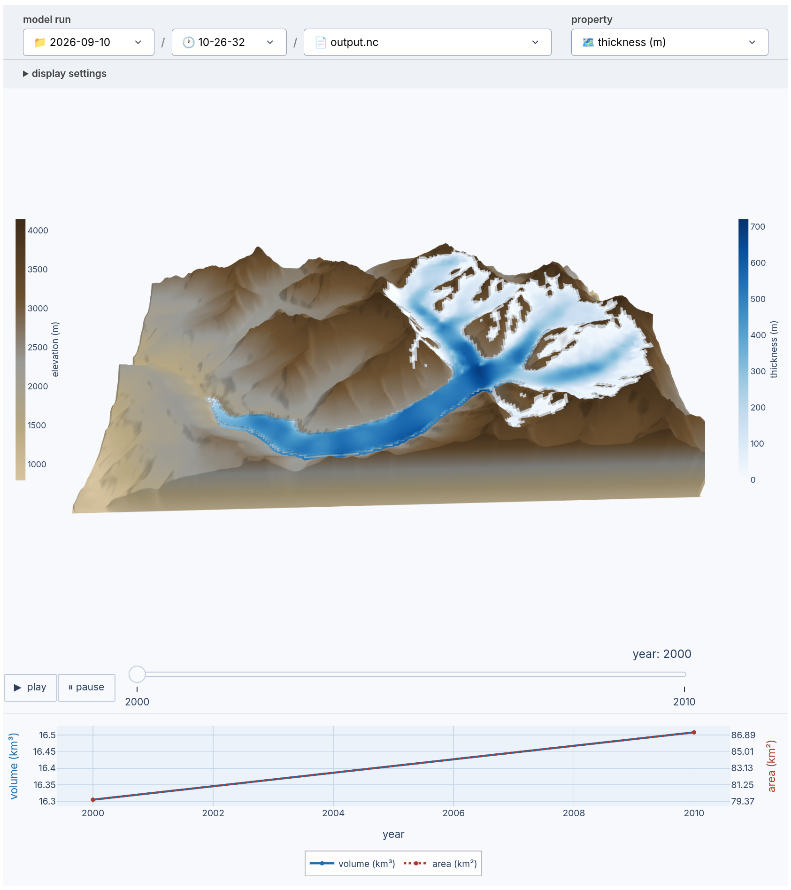

# Visualizing output with igm_viz

`igm_viz` is a Plotly/Dash app that renders a run's output as an interactive 3-D animation — glacier surface and bedrock, colored by any saved variable, steppable frame by frame or played back automatically. This tutorial walks through the app using the [Aletsch forward-modelling tutorial](aletsch.md) output as an example.

---

## Setup

```bash
pip install igm[viz]   # one-off install of the dash dependency
```

Run it from the same folder you ran `igm_run` in — it looks for `output.nc` under `outputs/*/*/` by default:

```bash
cd igm-examples/aletsch
igm_viz
```

This opens a local web app at `http://127.0.0.1:8050`.

If your `outputs/` folder isn't in the current directory, point `igm_viz` at it directly:

```bash
igm_viz --output_folder /path/to/other_experiment/outputs
```

The exact netCDF file to view is always picked afterward in the dashboard itself.



---

## Picking a run and a property

Every past run found under `outputs/*/*/` is listed in the **model run** picker at the top, so you can switch between runs without restarting the app. The **property** dropdown selects which variable colors the glacier surface — thickness, velocity, SMB, sliding coefficient, or any other 2-D+time field saved in the output.

---

## Adjusting the view

- **Vertical exaggeration** and **glacier opacity** sliders adjust the 3-D rendering.
- **Ocean plane** and **calving front** checkboxes add a sea-level plane and vertical ice walls where the glacier meets open ocean.
- **Colorbar range** can be clamped manually instead of scaling to the data's min/max.

---

## Animating and statistics

Step through frames with the slider at the bottom of the 3-D view, or hit **play** to animate. Below the 3-D view, a stats panel tracks glacier volume and area over time (or over iterations, for data-assimilation output).

---

## Data-assimilation output

`igm_viz` also reads data-assimilation outputs (`optimize.nc`, `geology-optimized.nc`), deriving bedrock elevation from `usurf - thk` when `topg` isn't saved. Pick one from the **model run** picker like any other file — no separate flag needed.

---

## Next steps

- **Run the tutorial that produced this output**: [Aletsch forward modelling](aletsch.md)
- **Recover a spatial field to visualize**: [Ice-thickness inversion](aletsch_inversion.md)
